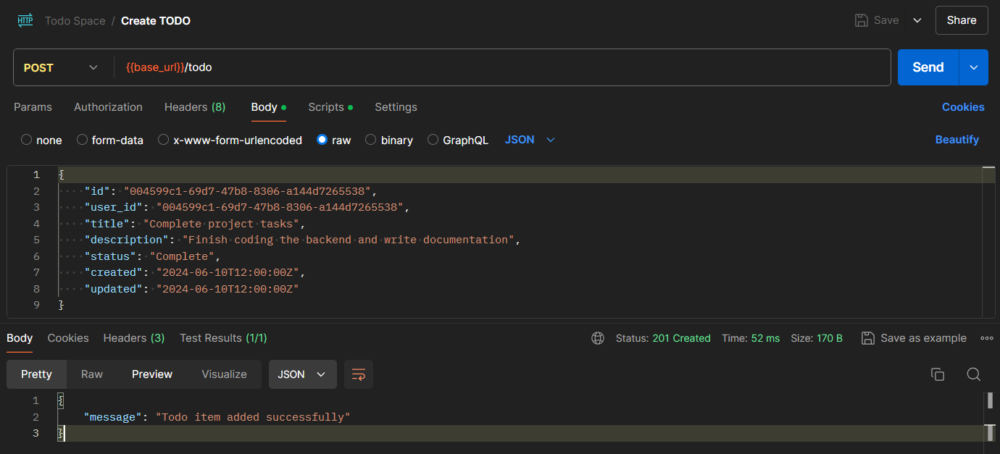
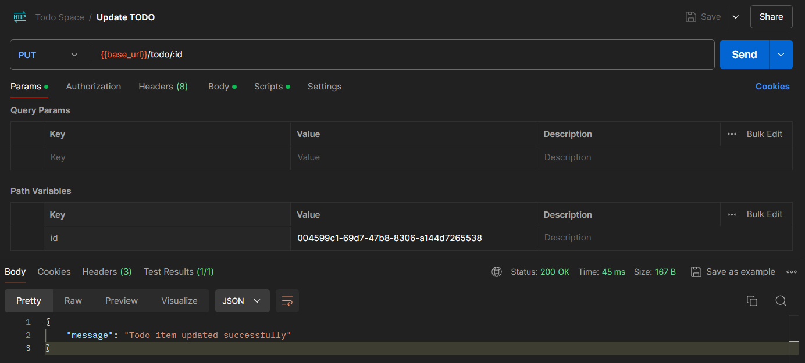
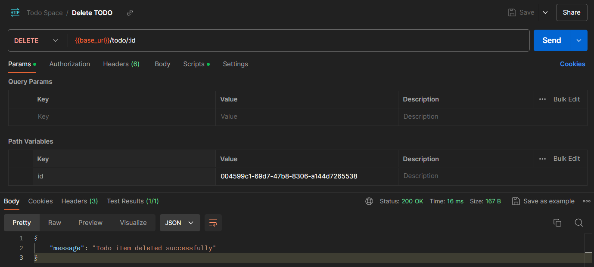
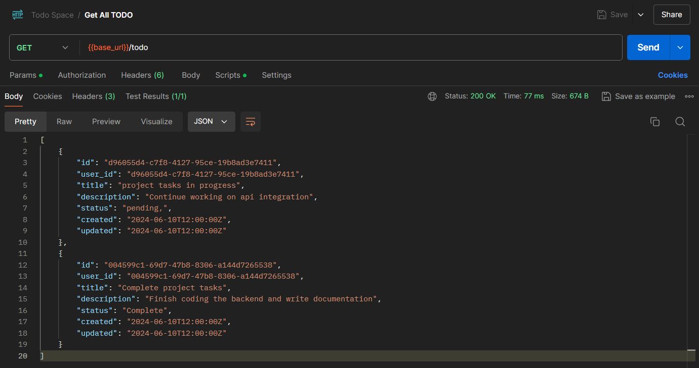
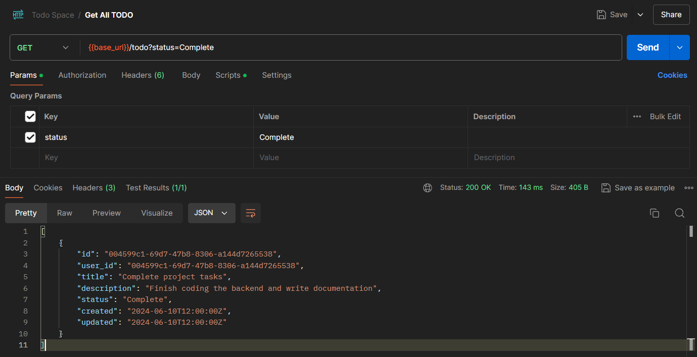

<h1 align="center">Todo Space 📑</h1>

# 💡 Objective
    Develop a TODO API using Golang and ScyllaDB that supports basic CRUD operations and includes pagination functionality for the list endpoint.

# 📒 Requirements
- Set up a Golang project and integrate ScyllaDB as the database for storing TODO items. Ensure that items in the database are stored user-wise.
- Implement endpoints for creating, reading, updating, and deleting TODO items for a single user at a time. Each TODO item should have at least the following properties: id, user_id, title, description, status, created, updated.
- Implement a paginated list endpoint to retrieve TODO items.
- Provide support for filtering based on TODO item status (e.g., pending, completed).


# ⚙️ API Documentation

### `POST` /v1/todo

Create a new todo item.

-   **URL:** `http://localhost:8080/v1/todo`
-   **Method:** POST
-   **Body:** json
    ```json
    {
        "id": "004599c1-69d7-47b8-8306-a144d7265538",
        "user_id": "004599c1-69d7-47b8-8306-a144d7265538",
        "title": "Complete project tasks",
        "description": "Finish coding the backend and write documentation",
        "status": "Complete",
        "created": "2024-06-10T12:00:00Z",
        "updated": "2024-06-10T12:00:00Z"
    }



### `PUT` /v1/todo/:id

Update a specific todo item.

-   **URL:** `http://localhost:8080/v1/todo/:id`
-   **Method:** PUT
-   **URL Parameters:**
    -   `id`: ID of the todo item to update



### `DELETE` /v1/todo/:id

Delete a specific todo item.

-   **URL:** `http://localhost:8080/v1/todo/:id`
-   **Method:** DELETE
-   **URL Parameters:**
    -   `id`: ID of the todo item to delete



### `GET` /v1/todo/:id

Retrieve details of a specific todo item.

-   **URL:** `http://localhost:8080/v1/todo/:id`
-   **Method:** GET
-   **URL Parameters:**
    -   `id`: ID of the todo item to retrieve


### `GET` /v1/todo

Retrieve all todo items based on filters.

-   **URL:** `http://localhost:8080/v1/todo`
-   **Method:** GET
-   **Query Parameters:**
    -   `status`: Filter by status (`pending` or `completed`)
    -   `size`: Number of items to retrieve (default 10)
    -   `lastPageToken`: Offset for pagination (default 0)





# 🏃‍♂️ Run Locally

- Clone this repository.
    ```js
    https://github.com/debrajhyper/Todo-Space.git
    ```
- Install Docker Desktop.
- Run `docker-compose -f  todospace-api.yml up` to initialize a Scylla-DB instance running on port 9042.
- Go from the main directory to `\cmd\api` and then run `go run main.go` to start the service.

<br/>

### Features Implemented:

- Implemented CRUD routes for interaction b/w server and ScyllaDB.
- The API's are paginated for easy data retrieval.
- The application's DB part is Dockerized and is stateful through volumes.
- Support for filtering based on TODO item status (e.g., pending, completed).

### Current Architecture:

- Containerized approach to solving the problem statement.
- Two Interfaces one for the server and one for db are interacting between each other for the backend application.

### Future Scope:

- The current architecture is a very basic implementation of the problem statement.
- Depending upon the scale, the entire architecture can be **scaled horizontally** using nginx load balancing.
- Web can use a queueing mechanism like Rabbit or BullMQ to introduce pub-sub architecture to improve performance.
- The Go-Server could be containerized to improve deployment.
- Introduction to goroutines would increase the overall throughput of the service.  

# 👨🏻‍💻 Developer's Talk
Developed by <a href="https://github.com/debrajhyper">Debraj Karmakar</a>
<span style="display:inline-flex; justify-content:space-evenly; width:20%;">
<a href="https://twitter.com/debraj_010">
  
</a>
<a href="https://linkedin.com/in/debraj-karmakar-275570199">
  
</a>
<a href="https://fb.com/debraj.karmakar.923">
  
</a>
<a href="https://www.behance.net/debrajkarmakar">
  
</a>
</span>

><a href="https://github.com/debrajhyper/Todo-Space">This</a> is a small effort from my side to build a small scale project using Golang and ScyllaDB technologies. The experience taught me so many things, as well as the challenges involved in overcoming problems encountered during the development phase. I consider this project very relevant to me as a full-stack developer.

<br/>

---